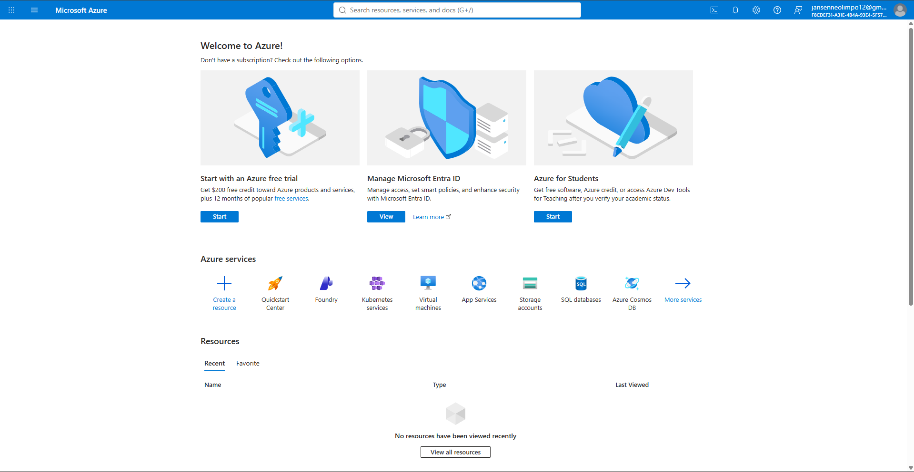

# Microsoft Azure Research

## Brief Overview

Microsoft Azure is a cloud computing platform that provides services for computing, storage, databases, networking, analytics, artificial intelligence, and application development.

## Global Infrastructure

Azure operates through a global network of regions and availability zones. These locations allow organizations to deploy applications closer to their users and build reliable cloud environments.

## Cloud Management Console

The Azure portal is a web-based management interface used to create, configure, monitor, and manage Azure resources and services.

## Four Core Services

### 1. Azure Virtual Machines
Azure Virtual Machines provide scalable virtual servers for running applications and workloads.

### 2. Azure Blob Storage
Azure Blob Storage is an object storage service designed to store large amounts of unstructured data.

### 3. Azure SQL Database
Azure SQL Database is a managed relational database service based on Microsoft SQL Server technology.

### 4. Microsoft Entra ID
Microsoft Entra ID provides identity and access management for users, applications, and resources.

## Three Advantages

1. **Microsoft Integration** – Azure works well with Microsoft products and technologies.
2. **Scalability** – Organizations can scale cloud resources according to their needs.
3. **Enterprise Features** – Azure provides services designed for security, identity, management, and enterprise workloads.

## Typical Enterprise Use Cases

Azure can be used for hosting business applications, migrating Windows Server workloads, managing databases, integrating Microsoft 365 environments, developing applications, and supporting enterprise data and AI workloads.

## Screenshot Evidence

## Sources

- [Microsoft Azure](https://azure.microsoft.com/)
- [Azure Documentation](https://learn.microsoft.com/azure/)
